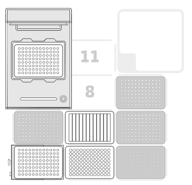

## README for Automated Directed Evolution SELEX Protocol

This protocol automates the Directed Evolution process, combining error-prone PCR (epPCR) library preparation with varying dNTP and manganese levels, followed by SELEX (Systematic Evolution of Ligands by Exponential enrichment) with increasing filter stringency. The protocol is broken into three parts to be run sequentially from part 1 to part 3. Each part consists of two PCR runs with four SELEX steps per run.

**Authors:** Pablo Sousa-Sanchez, Harry Doherty, Chris Schade, & Will Green

**Description:** This Opentrons protocol automates the following steps:

1. **epPCR Library Preparation:**  Sets up multiple reactions with varying concentrations of dNTPs and manganese to separately generate biased and diverse libraries of aptamers. Indivudual Libraries then pooled into single unbiased diverse one. 
2. **SELEX:**  Subjects the aptamer library to multiple rounds of selection with increasing stringency using magnetic beads and a magnetic module. Magnetic beads coated with streptavadin bind biotin fused to target proteins. Aptamers capable of binding to target protein are pulled down. To increase selecton pressures and ensure no non-specific binding a milk protein solution is coincubated. Aptamers binding to non target proteins are not pulled down due the absence of biotin-streptavadin in non-target proteins.
3. **Washing and Elution:** Washes the selected aptamers bound to magnetic beads with ethanol and heats it in the thermocycler to a temperature above the predicted denaturing temperature of the aptamer, which also helps ethanol evaporate. This ensures that the aptamer is no longer linked to the protein but all the other interactions remain. The sample is then eluted in water and with a second pulled down, the selected aptamers are isolated in the supernatant and can be cycled round again for subsequent epPCR rounds and SELEX to improve affinity and specificity.  

**Protocol Requirements:**

* **Opentrons Robot:**  OT-2
* **Opentrons Modules:** Thermocycler Module, Magnetic Module
* **Labware:**
    * Opentrons 96 Tip Rack 20 µL position 3
    * Opentrons 96 Tip Rack 300 µL position 4, 6, 9
    * NEST 12 Reservoir 15 mL position 5
    * Corning 96 Well Plate 360 µL Flat position 2
    * 4ti-0960RIG 96 Well Plate 200 µL (for Thermocycler and Magnetic Module) position 1 (Magnetic Module) and 7,8,9,10 (Thermocycler)
* **Pipettes:** 
    * p20 Single-Channel Gen2
    * p300 Single-Channel Gen2
* **Reagents:**
    * Master Mixes (A, T, C, G) Nucleotide corresponds to Master mix with a higher ratio of specified dNTP in a 2:1:1:1 ratio (80:40:40:40 uM ratio to have an overall [dNTP] of 200uM)
    * Manganese Chloride
    * Aptamer Library
    * Water
    * Milk Powder
    * Streptavidin Magnetic Beads incubated with biotinylated target protein (Magnetic Beads)
    * Ethanol
* **API Level:** 2.15

* **Reagent locations in the 96 well-plate**
    * Master Mix (High A) = A1
    * Master Mix (High T) = B1
    * Master Mix (High C) = C1
    * Master Mix (High G) = D1
    * Additional Manganese = E1
    * Intiral Library Aptamers = H1
    * Aptamers after first PCR run = A2
    * Aptamers after second PCR run = B2
    * Aptamers after third PCR run = C2
    * Aptamers after fourth PCR run = D2
    * Aptamers after fifth PCR run = E2
    * Aptamers after sixth PCR run = F2
    * Aptamers after first selex selection = A3
    * Aptamers after second selex selection = B3
    * Aptamers after third selex selection = C3
    * Aptamers after fourth selex selection = D3
    * Aptamers after fifth selex selection = E3
    * Aptamers after first selex selection = F3

* **Reagent locations in the 12-well reservoir**
    * water = A1
    * Milk Powder = A2
    * Magnetic Beads = A3
    * Ethanol = A4
    * Waste = A12

* **PCR Steps**
    * 35 cyles:
        Denaturing at 98⁰C for 10 seconds.
        Annealing at 66⁰C for 30 seconds.
        Extending at 72⁰C for 30 seconds.

    * Final extension at 72⁰C for for 2 minutes.

    * Holding temperature at 4⁰C.

**Instructions:**

1. **Prepare Reagents:**  Prepare the master mixes, manganese chloride solution, aptamer library, and other reagents according to your experimental design. Master mixes must be replaced after each part of the protocol before running the next part.
2. **Load Labware:**  Load the labware onto the Opentrons robot deck according to the specified slots in the code.
3. **Load Tips:**  Load the tipracks onto the robot deck. Tips must be replaced after each part of the protocol before running the next part.
4. **Fill Reagents:** Fill the reservoir and plate with the appropriate reagents as indicated in the code comments.
5. **Adjust Parameters:** Adjust the following parameters in the code if necessary:
    * `pcr_runs`: Number of PCR runs
    * `MP_volume`:  List of Milk Powder volumes for each SELEX round, which may be increased for every cycle.
    * `MB_volume`: Volume of Magnetic Beads. This should be at least 320 µL per protocol part.
    * `library_volume`: Starting volume of the aptamer library
    * `Flow rates`: Adjust the aspiration and dispense rates for the pipettes if needed
    * `btm_tc`:  Bottom adjustment for thermocycler pipette tip positioning in the thermocycler plate
    * `tc_mod.set_block_temperature`: Thermocycler temperature. Adjust to desired PCR cycling parameters.  

**Notes:**

* PCR reagents must be replaced 
The code includes a logger for tracking well volumes and actions.
* The protocol assumes a specific layout of reagents in the well plate and reservoir. Adjust the code if your layout is different.
* The SELEX part of the protocol involves multiple rounds of selection with increasing concentrations of Milk Powder. See references for an example concentration.
* The ethanol wash step may be divided into two parts to avoid overflowing the wells. This is implemented only for the first iteration of SELEX. Adapt for all cases if needed.
* The code includes comments to guide you through the different steps.

**Simlogger**

* wraps within protocol file such that it does not interfere with the Opentrons app
* run the logger_decorator.py with the filename of your prepared protocol to run a simulation with a bunch of extra features
    * tracks volumes of assays, warns on overfilling & pulling more than available
    * has dynamic flow rates that tell you the multiplier
    * more friendly naming conventions
* modifications to protocol file in order to work:
    * logger.wrap_instrument
    * logger.wrap_module
    * def initialize_logger
    * def update_well_tracking

**References:**

Cheah, J.S., Yamada, S., 2017. A simple elution strategy for biotinylated proteins bound to streptavidin conjugated beads using excess biotin and heat. Biochem. Biophys. Res. Commun. 493, 1522–1527. https://doi.org/10.1016/j.bbrc.2017.09.168 

Liu, Q., Zhang, W., Chen, S., Zhuang, Z., Zhang, Y., Jiang, L., Lin, J.S., 2020. SELEX tool: a novel and convenient gel-based diffusion method for monitoring of aptamer-target binding. J. Biol. Eng. 14, 1. https://doi.org/10.1186/s13036-019-0223-y 

Sefah, K., Shangguan, D., Xiong, X., O’Donoghue, M.B., Tan, W., 2010. Development of DNA aptamers using Cell-SELEX. Nat. Protoc. 5, 1169–1185. https://doi.org/10.1038/nprot.2010.66 

Lee, S.O. and Fried, S.D. (2021). An error prone PCR method for small amplicons. Analytical Biochemistry, [online] 628, pp.114266–114266. doi:https://doi.org/10.1016/j.ab.2021.114266.

‌
